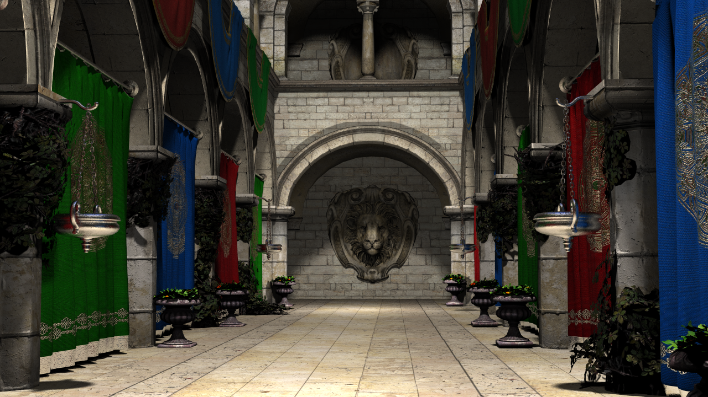
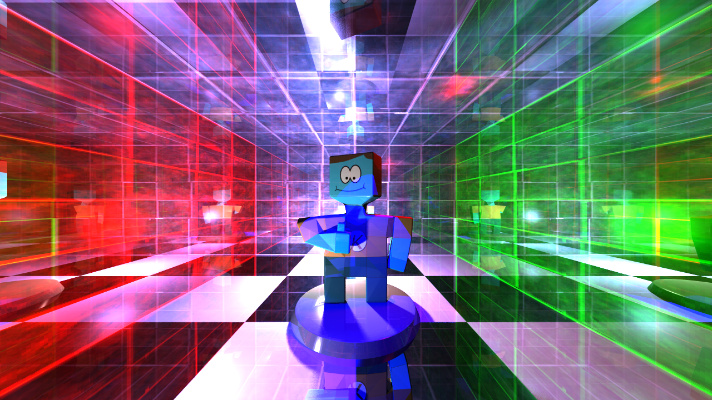
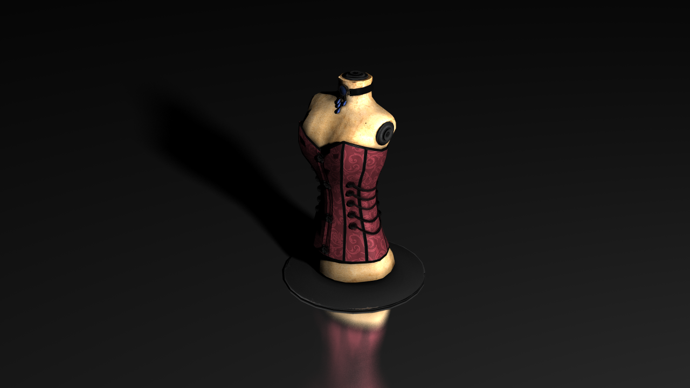
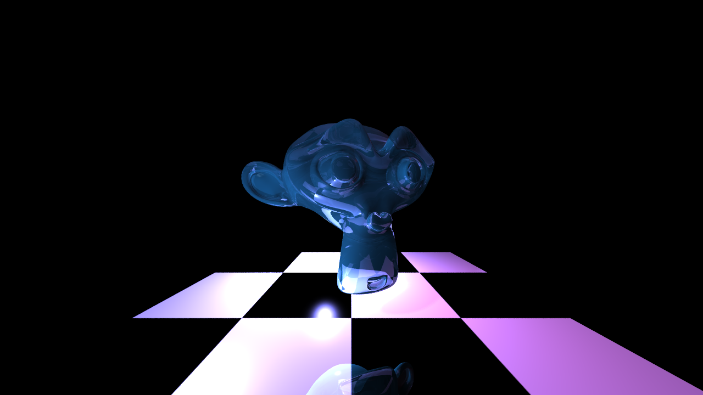
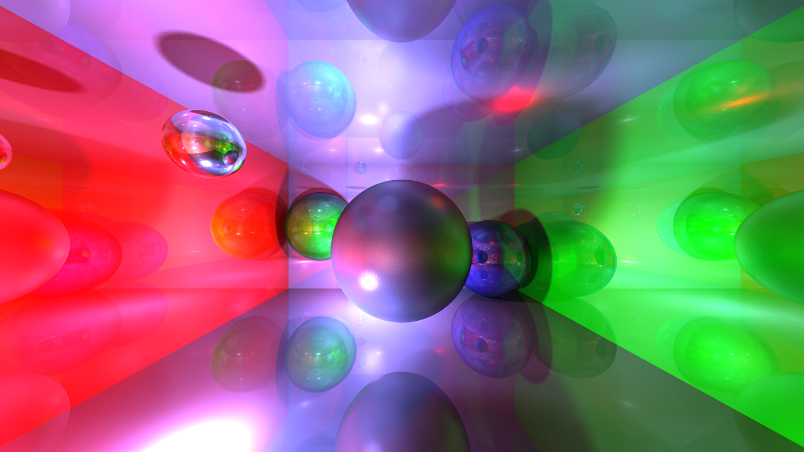

# Rustray - a raytracer build with Rust

## Screenshots

<sub>`cargo run --release -- scene/helmet.json samples=64 1280x720 monte_carlo=1`</sub>

<br>

<sub>`cargo run --release -- scene/sponza.json samples=128 1280x720 monte_carlo=1`</sub>

<br>

<sub>`cargo run --release -- scene/room.json scene/kbert.json samples=64 1280x720 monte_carlo=1`</sub>

<br>

<sub>`cargo run --release -- scene/latern.json samples=64 1280x720 monte_carlo=1`</sub>

<br>

<sub>`cargo run --release -- scene/corset.json samples=256 1280x720 monte_carlo=1`</sub>

<br>

<sub>`cargo run --release -- scene/floor.json scene/monkey.json samples=32 1280x720 monte_carlo=1`</sub>

<br>

<sub>`cargo run --release -- scene/room-no-textures.json scene/spheres.json samples=128 1280x720 monte_carlo=1`</sub>

<br>

## Features
* Shadow (it can be controled via `cast_shadow` and `receive_shadow`)
* Reflection
* Refraction
* Phong shading (sort of)
* Alpha/Opacity/Transparency via material setting or alpha map
* Supported shapes
  * Sphere
  * Triangle-Mesh
* Texture mapping
* Normal mapping (bump mapping)
* Wavefront (obj) object loading
* Anti-Aliasing
* DOF (Depth of field)
* Different light types (directional, point, spot)
* Monte Carlo raytracing (sort of)
* Fog
* Matrix based transformations
* Json based scenes
* GLTF based scenes
* PBR (sort of)
* Basic animation support

## usage
use cargo watch to run release version:
```bash
#install:
cargo install cargo-watch

#run with watch:
cargo watch -s "cargo run --release -- scene/helmet.json no-animation" -w src/

#run without watch
cargo run --release -- SCENE_NAME
cargo run --release -- scene/helmet.json
```

## command line args

* `PATH_TO_SCENE.json` -- set the path to a scene.json file (you can set multiple scene files)
* `no-animation` -- disable animation
* `cmd` -- cmd version without window
* `samples=1234` -- set samples amount
* `800x600` -- set render resolution
* `monte_carlo=1` -- enable monte carlo rendering


```bash
#example
cargo run --release -- scene/helmet.json no-animation samples=32 800x600 monte_carlo=1
```


## Linux (Ubuntu) requirements
```bash
sudo apt install cmake pkg-config libssl-dev build-essential cmake xorg-dev
```
